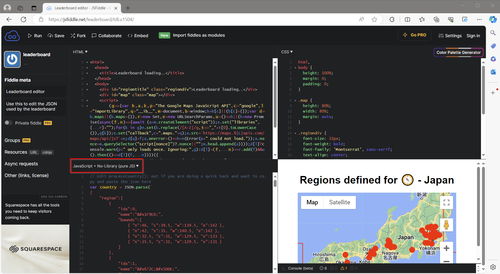
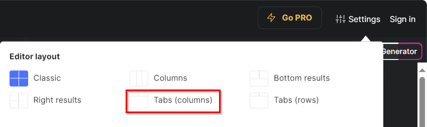
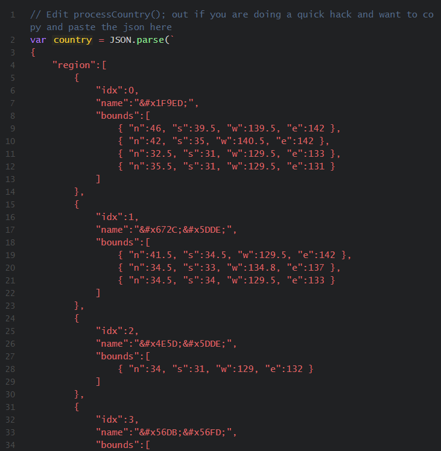
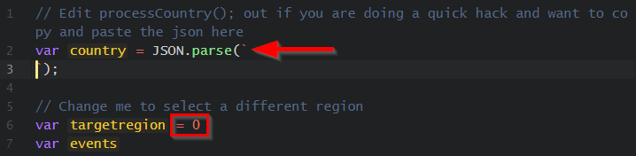

# Leaderboard-JSON
Contains all the JSON files used by https://leaderboard.cihipi.com and allows people to submit updates
## Greetings
If you are reading this, hopefully it means you want to make an update or help better define the regions of parkrun.
## How to update
- An account on https://jsfiddle.net will allow you to return to your updates
- If you are not strong on JSON, I suggest using a JSON editor such as https://jsoneditoronline.org/ This will help you find typos
### Detailed steps
1. Find the country that you want to update. For example Japan is regions.*jp*.json
2. Open the fiddle https://jsfiddle.net/leaderboard/tdLu1504/ 

You should see three windows
- HTML
- CSS
- JavaScript
3. You can change this to tabs by editting your settings in the top right hand corner.

4. Select the javascript tab or window.
5. Towards the top of the JavaScript page you should see a similar looking JSON file in red.

6. Copy the JSON text from github over the top of the existing text.

7. Change the line var targetregion = 0 to match the idx number in the JSON file.
8. Click run or press CTRL + Enter. The google map should update.
9. Editing the **n**orth, **s**outh, **e**ast or **w**est values will move the red rectangle. Events located inside the any of the rectangles will turn green. There isn't a known limit on the number of rectangles.

